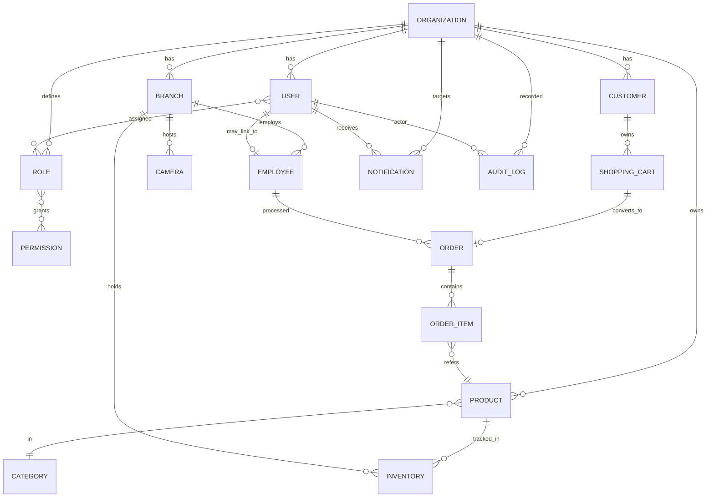
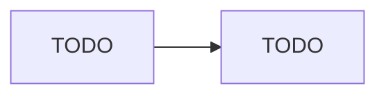

# Database ERD

> **Project:** VisionMart - Enterprise AI Smart Retail Platform
> **Domain:** https://visionmart.thehuan.com
> **Document:** 11_DATABASE_ERD.md
> **Status:** Draft - Template

---

## Purpose

> TODO - Describe the purpose of this document.

## Scope

> TODO - Define what is covered and what is explicitly out of scope.

## Revision History

| Version | Date       | Author | Description                                |
| ------- | ---------- | ------ | ------------------------------------------ |
| 0.1.0   | YYYY-MM-DD | TODO   | Initial template created.                  |
| 0.2.0   | Sprint 02  | TODO   | Initial ERD skeleton added (placeholders). |

## Table of Contents

1. [Purpose](#purpose)
2. [Scope](#scope)
3. [Overview](#overview)
4. [Definitions](#definitions)
5. [Requirements](#requirements)
6. [Architecture](#architecture)
7. [Components](#components)
8. [Workflow](#workflow)
9. [Future Improvements](#future-improvements)
10. [Notes](#notes)
11. [References](#references)

---

## Overview

> TODO - High-level summary of the topic addressed by this document.

### Sprint 02 — High-level ERD skeleton (placeholder)



> The diagram above is a placeholder. Cardinalities, attributes, and constraint
> details will be filled in during the data-model documentation sprint.

## Definitions

> TODO - Glossary of terms, acronyms, and abbreviations used in this document.

| Term | Definition |
| ---- | ---------- |
| TODO | TODO       |

## Requirements

> TODO - Functional and non-functional requirements relevant to this document.

### Functional Requirements

> TODO

### Non-Functional Requirements

> TODO

## Architecture

> TODO - Architectural description, diagrams, and key design decisions.

```text
TODO - Insert architecture diagram or description here.
```

## Components

> TODO - List and describe each component, module, or service involved.

| Component | Responsibility | Owner |
| --------- | -------------- | ----- |
| TODO      | TODO           | TODO  |

## Workflow

> TODO - Describe the end-to-end workflow, sequence, or process.



## Future Improvements

> TODO - Planned enhancements, open questions, and items deferred to later releases.

- TODO

## Notes

> TODO - Any additional notes, caveats, assumptions, or constraints.

## References

> TODO - List internal documents, external standards, and useful links.

- [VisionMart Project Repository](https://github.com/huanbv/VisionMart)
- TODO

---

_Last updated: template generation - awaiting content authoring._