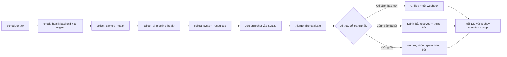

# Monitoring and Observability

> **Project:** VisionMart - Enterprise AI Smart Retail Platform
> **Domain:** https://visionmart.thehuan.com
> **Document:** 19_MONITORING.md
> **Status:** Implemented (Operational Monitoring layer, `monitoring/`)

---

## Purpose

Mô tả layer **Giám sát vận hành (Operational Monitoring)** của VisionMart:
theo dõi tình trạng camera, AI pipeline (YOLO/ByteTrack), tài nguyên hệ
thống (CPU/RAM/GPU/disk), Docker/Celery/Redis/PostgreSQL, cảnh báo tự động,
và nhật ký vòng đời phiên mua sắm (read-only) — phục vụ vận hành production
trên VPS. Tài liệu này cũng là hướng dẫn triển khai, giám sát, xử lý sự cố
và khôi phục cho layer này.

## Scope

**Trong phạm vi:** package `monitoring/` (service độc lập), router proxy
`backend/app/modules/ops_monitoring/`, trang frontend `/system-health`.

**Ngoài phạm vi:** không thay đổi Shopping Cart, Checkout, Payment, Event
Bus, hay logic AI hiện có. Monitoring **chỉ đọc** (read-only) — không bao
giờ ghi vào dữ liệu production (Postgres của app, Redis nghiệp vụ). Cảnh
báo bảo mật/phát hiện AI cho nhân viên (`backend/app/workers/tasks/alerts.py`,
`AlertService`) là một hệ thống khác, không thuộc tài liệu này.

## Revision History

| Version | Date       | Author        | Description                                   |
| ------- | ---------- | ------------- | ---------------------------------------------- |
| 0.1.0   | -          | -             | Initial template created.                      |
| 1.0.0   | 2026-07-04 | VisionMart Eng | Operational Monitoring layer implemented & documented. |

## Table of Contents

1. [Purpose](#purpose)
2. [Scope](#scope)
3. [Overview](#overview)
4. [Definitions](#definitions)
5. [Requirements](#requirements)
6. [Architecture](#architecture)
7. [Components](#components)
8. [Workflow](#workflow)
9. [Monitoring Capabilities](#monitoring-capabilities)
10. [Alert Rules](#alert-rules)
11. [Health Score & Release Information (Release Candidate)](#health-score--release-information-release-candidate)
12. [Deployment (VPS)](#deployment-vps)
13. [Log Rotation & Retention](#log-rotation--retention)
14. [Troubleshooting](#troubleshooting)
15. [Recovery Procedures](#recovery-procedures)
16. [Security Notes](#security-notes)
17. [Known Limitations & Honesty Notes](#known-limitations--honesty-notes)
18. [Future Improvements](#future-improvements)
19. [References](#references)

---

## Overview

`monitoring/` là một **service Python độc lập** (FastAPI + poller
asyncio + SQLite riêng), chạy song song với hệ thống production nhưng
**không import bất kỳ code nào** từ `backend/app/*` hay `ai-engine/app/*`.
Nó quan sát phần còn lại của hệ thống hoàn toàn qua các kênh đã tồn tại
sẵn:

- Gọi HTTP `GET /health` và `GET /metrics` (Prometheus format) của
  `backend` và `ai-engine` — hai endpoint này **đã có sẵn** trong code,
  monitoring không thêm gì vào 2 service đó.
- SQL thô (`sqlalchemy.text()`, không dùng ORM model) tới Postgres —
  chỉ `SELECT`, không bao giờ `INSERT/UPDATE/DELETE`.
- `redis.asyncio` client riêng để đọc độ dài queue.
- Một Celery client "dùng một lần" (`Celery(broker=...)`) chỉ để gọi
  `.control.inspect()` — không import `app.workers.celery_app`.
- Docker Engine API (`docker` SDK) qua `/var/run/docker.sock` (tùy chọn).
- `psutil`/`pynvml` để đọc CPU/RAM/GPU/disk của host.

Nhờ vậy, `monitoring/` có thể được build, deploy, restart hoặc tắt hoàn
toàn **mà không ảnh hưởng gì đến production** — kể cả khi nó bug hoặc
crash, hệ thống chính (backend/ai-engine/cart/checkout) vẫn chạy bình
thường.

Frontend truy cập dữ liệu monitoring qua một router proxy nhỏ trong
backend (`/api/v1/ops-monitoring/*`), tái sử dụng đăng nhập nhân viên
hiện có (JWT, role `super_admin`/`org_admin`) — trình duyệt **không bao
giờ** thấy token riêng của monitoring service.

## Definitions

| Term | Definition |
| ---- | ---------- |
| Monitoring service | Service FastAPI độc lập tại `monitoring/`, port nội bộ `8200`. |
| Poller | Vòng lặp nền (asyncio) bên trong monitoring service, chạy mỗi `MONITORING_POLL_INTERVAL_SECONDS` (mặc định 30s). |
| Alert Engine | Module đánh giá các `AlertRule` trên dữ liệu mỗi vòng poll, quản lý vòng đời active/resolved của cảnh báo. |
| Snapshot | Kết quả một lần thu thập (camera/ai_pipeline/system/service_health), lưu vào SQLite của monitoring. |
| Session lifecycle | Chuỗi giai đoạn của một giỏ hàng: tracking → cart_active → pending_checkout → completed/abandoned, suy ra read-only từ bảng `shopping_carts`. |
| ops-monitoring proxy | Router trong backend (`app/modules/ops_monitoring/`) forward request đã xác thực tới monitoring service. |

## Requirements

### Functional Requirements

1. Giám sát kết nối camera: online/offline, số lần reconnect, FPS,
   latency, dropped/frozen frames.
2. Giám sát AI pipeline: thời gian inference YOLO, thời gian xử lý
   ByteTrack, số track đang active, độ dài queue (khi có).
3. Giám sát tài nguyên hệ thống: CPU, RAM, GPU (nếu có), disk, Docker
   containers, Celery workers, Redis, PostgreSQL.
4. Alert Engine tạo cảnh báo có thể cấu hình (camera offline, CPU cao,
   latency vượt ngưỡng, worker lỗi, disk sắp đầy, v.v.).
5. Audit Log read-only ghi lại vòng đời từng phiên mua sắm.
6. Trang "System Health" hiển thị tình trạng hiện tại, uptime, trạng
   thái camera/AI/hạ tầng, các chỉ số hiệu năng chính.
7. Monitoring không bao giờ sửa dữ liệu production.
8. Hỗ trợ xoay vòng log (log rotation) và thời gian lưu trữ cấu hình
   được (retention).

### Non-Functional Requirements

- Không thay đổi Shopping Cart / Checkout / Payment / Event Bus / AI
  logic hiện có.
- Không thêm tính năng nghiệp vụ mới, không thiết kế lại kiến trúc.
- Chịu lỗi: một service backing (DB, Redis, Celery, Docker...) sập
  không được làm sập vòng poll hay toàn bộ monitoring service.
- Minh bạch: khi một chỉ số không đo được (ví dụ FPS khi
  `ENABLE_PERFORMANCE_METRICS=false`), API trả về `null` kèm lý do —
  không suy đoán hay giả lập số liệu.

## Architecture

```text
                    ┌───────────────────────────────────────────┐
                    │         monitoring/ (service riêng)        │
                    │  FastAPI :8200  +  poller asyncio  +  SQLite│
                    │                                             │
                    │  collectors/  ─▶ camera_health              │
                    │               ─▶ ai_pipeline_health          │
                    │               ─▶ system_resources            │
                    │  alerts/      ─▶ rules + engine + notifiers  │
                    │  audit/       ─▶ session_lifecycle (read-only)│
                    │  storage/     ─▶ SQLite (WAL) + retention    │
                    └───────────────┬────────────────────────────┘
             HTTP GET /health,/metrics │  raw SQL (SELECT only)
             redis LLEN │ celery inspect │ docker API │ psutil/pynvml
                    ▼                    ▼                 ▼
            ┌──────────────┐    ┌───────────────┐   ┌─────────────────┐
            │   backend    │    │   ai-engine    │   │ postgres / redis │
            │  (existing)  │    │   (existing)   │   │ celery / docker  │
            └──────┬───────┘    └───────────────┘   └─────────────────┘
                   │  Bearer MONITORING_API_TOKEN (server-side only)
                   ▼
     ┌───────────────────────────────┐
     │ backend: /api/v1/ops-monitoring/* │  (JWT auth, role admin)
     │  app/modules/ops_monitoring/       │
     └───────────────┬────────────────┘
                      ▼
        frontend: trang "/system-health" (SystemHealthPage.tsx)
```

Nguyên tắc thiết kế cốt lõi: `backend/` và `ai-engine/` đều tự định
nghĩa package top-level tên `app` không liên quan nhau — import cả hai
vào cùng một tiến trình Python là không an toàn (bài học rút ra khi xây
`evaluation/`). Vì vậy `monitoring/` **không import package nào của hai
service đó**; nó chỉ nói chuyện qua HTTP/SQL/Redis/Celery-broker/Docker
API/host — những kênh vốn đã public hoặc đã tồn tại độc lập với code Python
nội bộ.

## Components

| Component | Responsibility | Path |
| --------- | -------------- | ---- |
| Config | Đọc toàn bộ tham số từ biến môi trường, có default an toàn | `monitoring/config.py` |
| HTTP/Prometheus collector | Scrape `/health`, `/metrics` của backend & ai-engine | `monitoring/collectors/http_metrics.py` |
| Camera health collector | Online/offline, reconnect count, FPS, dropped frames, latency | `monitoring/collectors/camera_health.py` |
| AI pipeline collector | Inference time, queue length, request ok/error | `monitoring/collectors/ai_pipeline_health.py` |
| System resources collector | CPU/RAM/GPU/disk, Docker, Celery, Redis, Postgres | `monitoring/collectors/system_resources.py` |
| Alert rules | 11 rule mặc định, ngưỡng cấu hình qua env | `monitoring/alerts/rules.py` |
| Alert Engine | Diff active/resolved, dedup thông báo, gọi notifier | `monitoring/alerts/engine.py` |
| Notifiers | Ghi log + gửi webhook (Slack/Discord-compatible) | `monitoring/alerts/notifiers.py` |
| Session lifecycle audit | Suy ra giai đoạn giỏ hàng, ghi sự kiện khi đổi trạng thái, read-only | `monitoring/audit/session_lifecycle.py` |
| Storage | SQLite (WAL), 4 bảng, purge theo retention | `monitoring/storage/db.py`, `retention.py` |
| Scheduler | Vòng lặp poll nền, gọi collector + Alert Engine mỗi chu kỳ | `monitoring/scheduler.py` |
| Logging | RotatingFileHandler + console | `monitoring/logging_config.py` |
| API server | FastAPI, xác thực bearer token riêng, mount dashboard tĩnh | `monitoring/server.py` |
| Static dashboard | Trang HTML/JS thuần, poll `/api/overview` mỗi 15s | `monitoring/static/dashboard.html` |
| Backend proxy | Forward có xác thực JWT nhân viên → monitoring token | `backend/app/modules/ops_monitoring/api/router.py` |
| Frontend page | Trang "Giám sát hệ thống" trong app chính | `frontend/src/pages/SystemHealthPage.tsx` |

## Workflow

### Chu kỳ poll (mặc định 30 giây)



Mỗi bước thu thập được bọc trong `try/except` riêng — một service backing
(ví dụ Postgres) sập chỉ khiến phần liên quan báo `reachable: false`,
không làm hỏng các phần còn lại của vòng poll (đã kiểm chứng bằng test
tích hợp mô phỏng toàn bộ backing service không thể kết nối).

### Truy cập dữ liệu (đường đi được khuyến nghị)

```
Trình duyệt (nhân viên đã đăng nhập, JWT)
   → GET /api/v1/ops-monitoring/overview (backend, role admin)
   → backend tự thêm "Authorization: Bearer <MONITORING_API_TOKEN>"
   → GET http://monitoring:8200/api/overview
   → JSON trả về qua backend → trình duyệt
```

Token riêng của monitoring **không bao giờ** đi tới trình duyệt.

## Monitoring Capabilities

### Camera connectivity

- Trạng thái online/offline (đọc trực tiếp cột `is_online`, `last_seen_at`
  từ bảng `cameras`).
- Số lần reconnect **kể từ khi monitoring bắt đầu quan sát** — hệ thống
  hiện tại không lưu lịch sử online/offline, nên không thể tính "uptime %"
  hồi tố; số liệu này là quan sát tiến (going-forward) trung thực, không
  suy đoán.
- FPS, số dropped frames, latency pipeline trung bình — lấy từ Prometheus
  metrics `ai_engine_vision_camera_fps`,
  `ai_engine_vision_dropped_frames_total`,
  `ai_engine_vision_pipeline_total_seconds` (gắn label `camera_key`).
  **Chỉ có giá trị khi `ENABLE_PERFORMANCE_METRICS=true`** ở ai-engine
  (mặc định `false`); khi tắt, API trả `null` kèm lý do rõ ràng thay vì
  suy đoán.
- Frozen-frame detection: **chưa triển khai** — sẽ cần sửa
  `ai-engine/app/vision/`, nằm ngoài phạm vi "không sửa AI logic" của
  nhiệm vụ này. Trường `frozen_frame_detection_available` luôn `false`
  để nói rõ điều này thay vì báo sai.

### AI pipeline health

- Thời gian inference/tổng pipeline: đọc histogram Prometheus
  `ai_engine_vision_opencv_seconds`, `ai_engine_vision_yolo_bytetrack_seconds`,
  `ai_engine_vision_pipeline_total_seconds` (tính mean từ `_sum`/`_count`).
- Thời gian YOLO và ByteTrack **không tách riêng được** trong production vì
  code gọi `model.track()` gộp cả hai bước — tài liệu hoá rõ trong
  docstring của collector thay vì báo số liệu giả.
- Active track count: **chưa có** — cần thêm gauge vào
  `person_tracker.py`, ngoài phạm vi nhiệm vụ này (không sửa AI logic).
  Trường trả về là chuỗi `"not_available"` kèm lý do.
- Queue length: đọc `LLEN` trên Redis broker (mặc định queue `celery`).

### System resources

- CPU/RAM/Disk: `psutil` trên host chạy container monitoring.
- GPU: `pynvml` (bỏ qua nếu không có GPU/driver — không có trên VPS
  CPU-only theo `docs/DEPLOY_VPS.md`).
- Docker: liệt kê container có tiền tố `visionmart-`, CPU%, bộ nhớ,
  `Health` status, `RestartCount` — cần mount `/var/run/docker.sock`
  (tùy chọn, mặc định tắt trong `docker-compose.yml`).
- Celery: client tạm thời gọi `.control.inspect().ping()/.active()/.reserved()`
  trên broker hiện có — không cần import code Celery task của app.
- Redis / PostgreSQL: kết nối trực tiếp, `SELECT 1`, đếm
  `pg_stat_activity` (bỏ qua nếu role DB không có quyền).

### Session lifecycle audit (read-only)

- Suy ra giai đoạn hiện tại của mỗi giỏ hàng (`tracking` → `cart_active`
  → `pending_checkout` → `completed`/`abandoned`) từ trạng thái hiện tại
  của `shopping_carts`, chỉ `SELECT`, không đổi dữ liệu.
- Ghi nhận **lịch sử quan sát tiến** (kể từ khi monitoring bắt đầu chạy)
  mỗi khi giai đoạn của một giỏ hàng thay đổi giữa hai lần poll.
- **Không thể** tái tạo lịch sử đầy đủ trước khi monitoring bắt đầu chạy;
  và một checkout bị huỷ (`PENDING_CHECKOUT` → quay lại `ACTIVE`) không
  phân biệt được với giỏ hàng chưa từng thử checkout chỉ dựa vào trạng thái
  hiện tại (giới hạn dữ liệu có sẵn, không phải lỗi thiết kế).

## Alert Rules

Tất cả ngưỡng đọc từ biến môi trường (`MONITORING_ALERT_*`), có thể chỉnh
không cần build lại code.

| Rule ID | Mức độ | Điều kiện kích hoạt | Ngưỡng mặc định |
| ------- | ------ | -------------------- | --------------- |
| `camera_offline` | critical | Camera offline quá thời gian ân hạn | `MONITORING_ALERT_CAMERA_OFFLINE_GRACE_SECONDS=120` |
| `low_camera_fps` | warning | FPS camera dưới ngưỡng (khi online) | `MONITORING_ALERT_MIN_FPS=1.0` |
| `high_cpu` | warning | CPU host vượt ngưỡng | `MONITORING_ALERT_CPU_PERCENT=90` |
| `high_ram` | warning | RAM host vượt ngưỡng | `MONITORING_ALERT_RAM_PERCENT=90` |
| `low_disk_space` | critical | Disk sử dụng vượt ngưỡng | `MONITORING_ALERT_DISK_PERCENT=85` |
| `excessive_pipeline_latency` | warning | Tổng latency pipeline AI vượt ngưỡng | `MONITORING_ALERT_PIPELINE_LATENCY_MS=1000` |
| `celery_worker_failure` | critical | Không có worker Celery nào phản hồi ping | - |
| `redis_down` | critical | Redis không kết nối được | - |
| `postgres_down` | critical | PostgreSQL không kết nối được | - |
| `backend_unreachable` | critical | `GET /health` backend lỗi | - |
| `ai_engine_unreachable` | critical | `GET /health` ai-engine lỗi | - |
| `docker_container_unhealthy` | critical | Container `visionmart-*` không `running` hoặc health `unhealthy` | - |

Alert Engine chỉ gửi thông báo (log + webhook) khi **trạng thái thay đổi**
(mới xuất hiện hoặc vừa hết) — không spam lặp lại mỗi vòng poll trong khi
cảnh báo vẫn còn active. Đã kiểm chứng bằng test 3 vòng poll: vòng 1 phát
2 cảnh báo mới, vòng 2 (điều kiện không đổi) 0 cảnh báo mới, vòng 3 (điều
kiện hết) 2 cảnh báo tự động resolved.

## Health Score & Release Information (Release Candidate)

Bổ sung ở giai đoạn "Final Production Readiness" — additive, dùng lại
toàn bộ dữ liệu các collector ở trên đã thu thập, không thêm nguồn dữ
liệu mới nào.

### Global System Health Score

`monitoring/health_score.py`'s `compute_health_score()` gộp mọi snapshot
(`backend_health`, `ai_engine_health`, `camera`, `ai_pipeline`, `system`,
`evaluation`) thành **một điểm số 0-100 + nhãn trạng thái**, theo mô hình
trừ điểm có trọng số, minh bạch (mọi lần trừ điểm đều ghi lại lý do trong
`reasoning`):

| Thành phần | Điểm trừ nếu lỗi | Ghi chú |
| ---------- | ------------------ | ------- |
| Backend unreachable | -30 | |
| AI Engine unreachable | -25 | |
| PostgreSQL unreachable | -25 | |
| Redis unreachable | -15 | |
| Không có Celery worker | -15 | |
| Docker container không running/unhealthy | tối đa -15 (5 điểm/container) | Bỏ qua nếu không mount Docker socket (không tính là lỗi) |
| CPU/RAM vượt ngưỡng | -10 mỗi mục | Ngưỡng theo `MONITORING_ALERT_CPU_PERCENT`/`RAM_PERCENT` |
| Disk vượt ngưỡng | -15 | Ngưỡng theo `MONITORING_ALERT_DISK_PERCENT` |
| Camera offline | tối đa -20 (theo tỉ lệ offline) | |
| AI pipeline latency vượt ngưỡng | -10 | |
| Evaluation reports không truy cập được | -5 | Tín hiệu tuỳ chọn, không phải production-critical |

Nhãn trạng thái suy ra từ điểm số: **Healthy** (≥90), **Warning** (≥75),
**Degraded** (≥50), **Critical** (≥25), **Offline** (<25). Có một
**override đặc biệt**: bất kể điểm số bao nhiêu, nếu **cả Backend VÀ
PostgreSQL** đều unreachable cùng lúc, trạng thái luôn là **Offline** —
vì trong trường hợp đó hệ thống thực sự không dùng được, khác về bản chất
với "đang gặp khó khăn nhưng vẫn chạy".

Ví dụ response `GET /api/health-score`:

```json
{
  "score": 96,
  "status": "Healthy",
  "components": {"Backend": "OK", "AI Engine": "Healthy", "PostgreSQL": "OK", "Redis": "OK", "Celery": "OK", "Docker": "NOT_CONFIGURED", "CPU": "34%", "RAM": "58%", "Disk": "61%", "GPU": "not available", "Camera": "OK", "AI Pipeline Latency": "312ms", "Evaluation": "OK"},
  "reasoning": ["No issues detected across any monitored component."],
  "generated_at": 1783159287.82
}
```

Hiển thị **nổi bật** trên trang "/system-health": thẻ điểm số lớn ngay
đầu trang (sau thanh trạng thái cập nhật), kèm nhãn trạng thái màu theo
mức độ, danh sách chip từng thành phần, và một khối "Chi tiết tính điểm"
có thể mở rộng để xem đầy đủ `reasoning`.

### Release Information

Xem chi tiết đầy đủ tại [docs/44_VERSIONING.md](44_VERSIONING.md).
Tóm tắt: `GET /api/release-info` trả về application version, git commit,
build time, Docker image tag, environment, phiên bản backend/ai-engine,
Python/Node, database version, OS/kernel — gộp từ `release_info.json`
(sinh bởi `scripts/generate_release_info.py` lúc build) và dữ liệu
runtime của chính container monitoring. Hiển thị ở panel cuối trang
"/system-health".

### Production Readiness Report

Xem chi tiết đầy đủ tại
[docs/46_DEPLOYMENT_VALIDATION.md](46_DEPLOYMENT_VALIDATION.md).
Tóm tắt: `GET /api/readiness` (qua package mới `visionmart/`, tái sử dụng
mọi collector đã có ở trên) trả về báo cáo PASS/WARNING/FAIL theo 13+1
category (Database, Redis, Celery, Docker, Monitoring, Evaluation,
Camera, Storage, Backup, Logging, Health, Configuration, Security, Python
Dependencies) — cùng engine với lệnh `visionmart doctor` (không trùng lặp
logic kiểm tra).

## Deployment (VPS)

Tài liệu này bổ sung cho quy trình chính ở
[docs/DEPLOY_VPS.md](DEPLOY_VPS.md) — chỉ nêu phần **thêm mới** cho
monitoring, không lặp lại các bước SSH/firewall/TLS đã có.

### 1. Biến môi trường

Thêm/khớp các biến sau trong `.env` (đã có template trong
`.env.example`, mục "Operational Monitoring"):

| Biến | Ghi chú |
| ---- | ------- |
| `MONITORING_API_TOKEN` | **Bắt buộc đổi** giá trị mạnh khi `APP_ENV=production` — backend sẽ từ chối khởi động nếu vẫn là giá trị mặc định (`_validate_production_safety` trong `settings.py`). Phải **giống hệt** giá trị monitoring service tự đọc (cùng file `.env`). |
| `MONITORING_SERVICE_URL` | Backend dùng để gọi monitoring — mặc định `http://monitoring:8200` (tên service trong Docker network nội bộ, không public ra ngoài). |
| `MONITORING_POLL_INTERVAL_SECONDS` | Tần suất poll — cân nhắc VPS yếu thì tăng lên (60s) để giảm tải. |
| `MONITORING_RETENTION_DAYS` | Số ngày giữ dữ liệu SQLite của monitoring trước khi bị xoá. |
| `MONITORING_WEBHOOK_URL` | Tuỳ chọn: Slack/Discord incoming webhook để nhận cảnh báo ngoài dashboard. |

```bash
chmod 600 .env   # như mọi secret khác của dự án
openssl rand -hex 32   # dùng để sinh MONITORING_API_TOKEN mạnh
```

### 2. docker-compose.yml

Service `monitoring` đã được thêm sẵn (additive, không sửa service nào
khác). Kiểm tra volume dữ liệu và (tuỳ chọn) mount Docker socket nếu muốn
giám sát container-level:

```yaml
monitoring:
  build:
    context: .
    dockerfile: monitoring/Dockerfile
  volumes:
    - ./monitoring:/app/monitoring
    - monitoring_data:/data
    # Tuỳ chọn — bật để có Docker container status (CPU%, health, restart count):
    # - /var/run/docker.sock:/var/run/docker.sock:ro
```

> Mount `/var/run/docker.sock` cho container đọc là **rủi ro bảo mật cần
> cân nhắc** trên VPS (xem [Security Notes](#security-notes)). Nếu không
> cần chỉ số container-level, để nguyên comment — các collector khác vẫn
> hoạt động bình thường, chỉ mục `docker.reachable` sẽ là `false`.

### 3. Build & khởi động

```bash
cd /opt/visionmart
docker compose build monitoring
docker compose up -d monitoring
docker compose logs -f monitoring
```

Kiểm tra nhanh:

```bash
# Từ trong network Docker (không public port 8200 ra ngoài)
docker compose exec backend curl -fsS http://monitoring:8200/health | jq

# Qua backend (yêu cầu JWT nhân viên role admin)
curl -fsS https://visionmart.thehuan.com/api/v1/ops-monitoring/overview \
     -H "Authorization: Bearer <jwt-token>" | jq
```

### 4. Nginx / firewall

**Không** mở port `8200` ra internet — monitoring chỉ nên truy cập được
từ trong Docker network nội bộ, qua backend proxy. Không cần thêm rule
UFW nào so với [docs/DEPLOY_VPS.md](DEPLOY_VPS.md) (chỉ 22/80/443 mở ra
ngoài).

### 5. Truy cập dashboard trong app

Đăng nhập bằng tài khoản `super_admin`/`org_admin`, vào menu **"Giám sát
hệ thống"** (route `/system-health`). Trang tự refresh mỗi 15 giây (có
thể tắt).

### 6. Checklist triển khai bổ sung (monitoring)

- [ ] `.env` có `MONITORING_API_TOKEN` mạnh, khác giá trị mặc định.
- [ ] `docker compose ps` — service `monitoring` ở trạng thái `healthy`.
- [ ] `docker compose logs monitoring` không có lỗi khởi động.
- [ ] Port `8200` **không** lộ ra ngoài UFW (`ufw status` chỉ có 22/80/443).
- [ ] Đăng nhập trang `/system-health` thấy dữ liệu camera/AI/hệ thống.
- [ ] (Tuỳ chọn) Webhook cảnh báo test thành công nếu dùng `MONITORING_WEBHOOK_URL`.
- [ ] Thư mục volume `monitoring_data` được backup cùng lịch backup chung
      (không bắt buộc — dữ liệu này là quan sát vận hành, có thể tái tạo
      từ đầu nếu mất, không phải dữ liệu nghiệp vụ).

## Log Rotation & Retention

- **Log file** (`monitoring/logging_config.py`): `RotatingFileHandler`
  ghi vào `MONITORING_LOG_DIR/monitoring.log`, xoay vòng khi đạt
  `MONITORING_LOG_MAX_BYTES` (mặc định 10MB), giữ tối đa
  `MONITORING_LOG_BACKUP_COUNT` bản cũ (mặc định 5) — tổng dung lượng tối
  đa ~60MB, không phình vô hạn.
- **Dữ liệu SQLite** (`monitoring/storage/retention.py`): mỗi 120 vòng
  poll (~1 giờ với chu kỳ 30s mặc định), chạy `purge_older_than()` xoá
  các bản ghi (`resource_snapshots`, `camera_state_events`,
  `session_lifecycle_events`, và **chỉ** các `alerts` đã `resolved`) cũ
  hơn `MONITORING_RETENTION_DAYS` (mặc định 30 ngày), sau đó `VACUUM` để
  thu hồi dung lượng đĩa. Cảnh báo đang **active** không bao giờ bị xoá
  dù cũ tới đâu — tránh mất dấu một sự cố chưa được xử lý.
- Điều chỉnh: đổi `MONITORING_RETENTION_DAYS`, `MONITORING_LOG_MAX_BYTES`,
  `MONITORING_LOG_BACKUP_COUNT` trong `.env` rồi `docker compose restart
  monitoring`.

## Troubleshooting

| Triệu chứng | Nguyên nhân khả dĩ | Cách xử lý |
| ----------- | ------------------- | ---------- |
| Trang "Giám sát hệ thống" báo lỗi 502 | Monitoring service chưa chạy hoặc backend không gọi tới được | `docker compose ps monitoring`; `docker compose logs monitoring`; kiểm tra `MONITORING_SERVICE_URL` trong `.env` khớp tên service trong `docker-compose.yml` |
| Trang báo 403/401 khi backend gọi monitoring | `MONITORING_API_TOKEN` giữa backend và monitoring không khớp | Đảm bảo cả hai đọc **cùng một file `.env`** (biến này không có prefix riêng theo service) |
| Tất cả camera hiện "FPS: không có dữ liệu" | `ENABLE_PERFORMANCE_METRICS=false` ở ai-engine (mặc định) | Đây là hành vi đúng, không phải lỗi — bật `ENABLE_PERFORMANCE_METRICS=true` trong `.env` của ai-engine nếu cần số liệu FPS/latency chi tiết (có thể tăng nhẹ tải CPU) |
| `system.docker.reachable = false` | Không mount `/var/run/docker.sock`, hoặc VPS không chạy Docker (hiếm) | Mặc định là tắt — chỉ bật mount trong `docker-compose.yml` nếu thực sự cần container-level metrics, cân nhắc rủi ro ở mục Security Notes |
| `system.postgres.reachable = false` dù DB đang chạy tốt | `DATABASE_URL` sai, hoặc role Postgres không có quyền `SELECT` trên `pg_stat_activity` | Kiểm tra `.env`; nếu chỉ thiếu quyền thống kê, các số liệu khác (camera, cart) vẫn hoạt động — đây là suy giảm một phần, không phải lỗi toàn bộ |
| Cảnh báo `celery_worker_failure` dù worker đang chạy | Broker URL monitoring trỏ sai (`CELERY_BROKER_URL`/`REDIS_URL`), hoặc `.control.inspect()` timeout do worker quá tải | `docker compose exec celery-worker celery -A app.workers.celery_app inspect ping`; kiểm tra `CELERY_BROKER_URL` trong `.env` |
| Dashboard tĩnh `/dashboard` (nếu dùng trực tiếp, không qua app chính) hỏi token mỗi lần load | Token lưu trong `localStorage` của trình duyệt, có thể bị xoá khi clear site data | Nhập lại `MONITORING_API_TOKEN`; khuyến nghị dùng trang `/system-health` trong app chính thay vì truy cập `/dashboard` trực tiếp, vì trang đó dùng JWT nhân viên, không cần nhớ token riêng |
| Log monitoring phình to nhanh | `MONITORING_LOG_MAX_BYTES`/`MONITORING_LOG_BACKUP_COUNT` đặt quá lớn, hoặc log level DEBUG | Giảm `MONITORING_LOG_MAX_BYTES`, kiểm tra `LOG_LEVEL` |
| SQLite `monitoring.db` phình to | Retention sweep chưa chạy đủ lâu (chạy mỗi ~1 giờ), hoặc có quá nhiều alert active không bao giờ resolved | Kiểm tra danh sách alert active (`/api/alerts`) — resolve/khắc phục nguyên nhân gốc; retention không xoá alert đang active theo thiết kế |

## Recovery Procedures

### Monitoring service crash hoặc không phản hồi

Vì monitoring hoàn toàn tách biệt, việc restart không ảnh hưởng production:

```bash
docker compose restart monitoring
docker compose logs -f monitoring   # theo dõi khởi động lại
```

Nếu vẫn lỗi, kiểm tra image build lại từ đầu:

```bash
docker compose build --no-cache monitoring
docker compose up -d monitoring
```

### Dữ liệu SQLite của monitoring hỏng/bị khoá (WAL corruption hiếm gặp)

Dữ liệu này **không phải dữ liệu nghiệp vụ** — có thể xoá và để monitoring
tự khởi tạo lại schema rỗng, chỉ mất lịch sử quan sát cũ (không mất dữ
liệu production):

```bash
docker compose stop monitoring
docker volume rm visionmart_monitoring_data   # tên volume theo project prefix thực tế
docker compose up -d monitoring
```

### Cần tắt hẳn Monitoring (ví dụ để debug tài nguyên VPS)

```bash
docker compose stop monitoring
```

Backend proxy (`/api/v1/ops-monitoring/*`) sẽ trả 502 rõ ràng
("Monitoring service unreachable") thay vì lỗi mơ hồ; trang
`/system-health` hiển thị trạng thái "không truy cập được" — không ảnh
hưởng các trang khác của app hay luồng bán hàng/checkout.

### Rotate `MONITORING_API_TOKEN`

```bash
# 1. Sinh token mới
NEW_TOKEN=$(openssl rand -hex 32)

# 2. Cập nhật .env
sed -i "s/^MONITORING_API_TOKEN=.*/MONITORING_API_TOKEN=$NEW_TOKEN/" .env

# 3. Restart cả hai phía cùng lúc (token phải khớp)
docker compose up -d monitoring backend
```

## Security Notes

- Token của monitoring (`MONITORING_API_TOKEN`) là cơ chế xác thực
  **riêng, đơn giản** (so sánh hằng thời gian bằng `hmac.compare_digest`)
  — không phải hệ thống JWT/role đầy đủ như app chính. Đường dẫn truy cập
  khuyến nghị là qua backend proxy (đã có JWT + role admin); nếu vô tình
  public port `8200` ra internet, bất kỳ ai có token đều đọc được toàn bộ
  dữ liệu vận hành (không phải dữ liệu khách hàng, nhưng bao gồm thông tin
  hạ tầng nội bộ) — do đó **luôn giữ port 8200 chỉ trong Docker network
  nội bộ**, không thêm vào Nginx public.
- Mount `/var/run/docker.sock` cho một container là **cấp quyền tương
  đương root trên host** nếu container đó bị chiếm quyền — cân nhắc kỹ
  trước khi bật trên VPS production; nếu chỉ cần biết container có chạy
  hay không, healthcheck của Docker Compose (`docker compose ps`) đã đủ
  cho vận hành thủ công.
- Audit Log vòng đời phiên mua sắm chỉ đọc (`SELECT`) — không có endpoint
  nào trong `monitoring/` hay `ops_monitoring/` cho phép ghi/sửa/xoá dữ
  liệu nghiệp vụ.

## Known Limitations & Honesty Notes

Các giới hạn dưới đây được thiết kế để **báo cáo trung thực** thay vì suy
đoán số liệu — quan trọng để trình bày minh bạch trong báo cáo đồ án:

- **Uptime % lịch sử của camera không tái tạo được** — schema `cameras`
  chỉ lưu trạng thái tức thời (`is_online`, `last_seen_at`), không có
  bảng log sự kiện online/offline trước khi monitoring bắt đầu chạy. Số
  liệu reconnect count là quan sát tiến, trung thực kể từ thời điểm
  monitoring khởi động.
- **FPS/latency camera phụ thuộc `ENABLE_PERFORMANCE_METRICS`** (mặc định
  tắt ở ai-engine) — khi tắt, các trường liên quan trả `null` kèm lý do,
  không suy đoán từ dữ liệu khác.
- **Không tách được thời gian YOLO và ByteTrack riêng** trong production
  vì code gọi `model.track()` gộp cả hai bước trong một lần đo.
- **Không có active track count** — cần sửa `person_tracker.py` để thêm
  gauge, nằm ngoài phạm vi "không sửa AI logic" của nhiệm vụ này.
- **Frozen-frame detection chưa triển khai** — cùng lý do trên.
- **Checkout bị huỷ không phân biệt được với giỏ hàng chưa từng
  checkout** chỉ dựa vào trạng thái hiện tại của `shopping_carts` (một
  `PENDING_CHECKOUT` bị huỷ quay lại `ACTIVE`, giống hệt một giỏ hàng active
  bình thường) — giới hạn dữ liệu, đã ghi nhận tương tự trong
  `evaluation/cart/cart_metrics.py`.

## Future Improvements

- Thêm bảng lịch sử online/offline camera ở tầng production (ngoài phạm
  vi nhiệm vụ hiện tại — cần sửa module camera) để tính uptime % chính
  xác hồi tố.
- Thêm gauge active-track-count và tách thời gian YOLO/ByteTrack trong
  `ai-engine/app/services/person_tracker.py`.
- Tích hợp Prometheus + Grafana đầy đủ (thay vì dashboard tĩnh tự viết)
  nếu quy mô mở rộng — `monitoring/` đã tương thích vì nó đọc cùng nguồn
  `/metrics` mà một Prometheus server thật cũng sẽ scrape.
- Cảnh báo qua email/SMS ngoài webhook hiện có.

## Notes

- Toàn bộ `monitoring/` được kiểm thử bằng thực thi thực tế trong sandbox
  phát triển: unit test cho từng collector (dữ liệu giả lập khi thiếu
  YOLO/GPU/hạ tầng thật), test tích hợp toàn vòng poll khi mọi service
  backing không thể kết nối (xác nhận không crash, báo lỗi đúng, bắn đúng
  5 cảnh báo hạ tầng), test vòng đời Alert Engine qua 3 vòng poll (mới →
  duy trì → resolved), test log rotation (200 dòng log với ngưỡng nhỏ →
  đúng 3 file xoay vòng), và test FastAPI server qua `TestClient` (401/403/
  200 theo token).
- Không có footage camera thật hay GPU trong môi trường phát triển — các
  số liệu camera/AI trong ví dụ trên là dữ liệu giả lập để kiểm thử logic,
  không phải số liệu production thật.

## References

- Kiến trúc & quy trình deploy VPS đầy đủ: [docs/DEPLOY_VPS.md](DEPLOY_VPS.md)
- Kế hoạch triển khai Tier 1/Tier 2: [docs/07_DEPLOYMENT_PLAN.md](07_DEPLOYMENT_PLAN.md)
- Logging chung của hệ thống: [docs/18_LOGGING.md](18_LOGGING.md)
- Bảo mật, secret rotation: [docs/08_SECURITY_GUIDELINE.md](08_SECURITY_GUIDELINE.md)
- Backup & Recovery chung: [docs/43_BACKUP_RECOVERY.md](43_BACKUP_RECOVERY.md)
- Release Information chi tiết: [docs/44_VERSIONING.md](44_VERSIONING.md)
- Production Readiness Report & `visionmart doctor`: [docs/46_DEPLOYMENT_VALIDATION.md](46_DEPLOYMENT_VALIDATION.md)
- Video pipeline / OpenCV Sprint 1 (nguồn Prometheus metrics camera):
  [docs/22_VIDEO_PIPELINE.md](22_VIDEO_PIPELINE.md),
  [docs/OPENCV_INTEGRATION_SPRINT1_REPORT.md](OPENCV_INTEGRATION_SPRINT1_REPORT.md)
- Khung đánh giá thực nghiệm (khác mục đích — đánh giá học thuật, không
  phải giám sát vận hành): [docs/EVALUATION_FRAMEWORK.md](EVALUATION_FRAMEWORK.md)
- Code: `monitoring/` (toàn bộ package), `backend/app/modules/ops_monitoring/`,
  `frontend/src/pages/SystemHealthPage.tsx`, `frontend/src/api/opsMonitoring.ts`.

---

*Tài liệu này mô tả layer Operational Monitoring bổ sung (task Production
Hardening) — không thay thế, không sửa đổi các tài liệu kiến trúc/nghiệp
vụ hiện có của VisionMart.*
