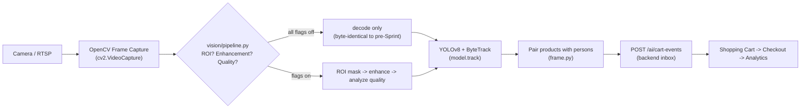

# Video Pipeline

> **Project:** VisionMart - Enterprise AI Smart Retail Platform
> **Domain:** https://visionmart.thehuan.com
> **Document:** 22_VIDEO_PIPELINE.md
> **Status:** Active

---

## Purpose

Describes how a camera frame becomes a cart event: what OpenCV does, what
YOLOv8 does, what ByteTrack does, and where the backend (Shopping Cart /
Checkout / Analytics) takes over. Written after the "OpenCV Integration
Sprint 1" that introduced the `ai-engine/app/vision/` package as a
dedicated Classical Computer Vision preprocessing layer in front of YOLO.

## Scope

Covers the `ai-engine` service's frame-processing path: RTSP/video frame
capture, the OpenCV preprocessing layer, YOLOv8 detection, ByteTrack
tracking, and the hand-off to the backend's AI cart-event inbox.

Out of scope: the backend's own cart/checkout state machine (see
`26_CART_ENGINE.md`), payment/QR confirmation flow, and anything after an
AI event is accepted by the backend.

## Revision History

| Version | Date       | Author                          | Description                                                        |
| ------- | ---------- | -------------------------------- | -------------------------------------------------------------------- |
| 0.1.0   | -          | -                                 | Initial template created.                                            |
| 1.0.0   | 2026-07-04 | OpenCV Integration Sprint 1       | Documented the frame pipeline and the new `vision/` preprocessing layer. |

## Table of Contents

1. [Purpose](#purpose)
2. [Scope](#scope)
3. [Overview](#overview)
4. [Definitions](#definitions)
5. [Requirements](#requirements)
6. [Architecture](#architecture)
7. [Components](#components)
8. [Workflow](#workflow)
9. [Future Improvements](#future-improvements)
10. [Notes](#notes)
11. [References](#references)

---

## Overview

A frame reaches `ai-engine` one of two ways: (a) the backend's
`frame_pipeline` Celery task pulls a frame from a camera's RTSP/video
stream (`POST /capture`, OpenCV `cv2.VideoCapture`) and forwards its bytes
to `POST /ai/frame`, or (b) a client uploads a frame directly to
`POST /ai/frame` (e.g. the `/cart/simulate` demo). Either way, `/ai/frame`
runs the same pipeline:

```text
Camera / RTSP
   |
   v
OpenCV Frame Capture        (existing: app/api/capture.py::_grab_frame)
   |
   v
OpenCV Image Analysis /     (new, Sprint 1: app/vision/)
OpenCV Image Enhancement    ROI -> enhancement -> quality analysis,
                             each independently toggleable, all off by
                             default (byte-identical to pre-Sprint decode)
   |
   v
YOLOv8 detection            (ultralytics, app/services/yolo_detector.py /
                             person_tracker.py — unchanged by Sprint 1)
   |
   v
ByteTrack tracking          (ultralytics' built-in tracker, unchanged)
   |
   v
AI cart-event proposal      (person_tracker.py pairs products with people,
                             frame.py posts product_picked_up /
                             product_returned / checkout_initiated to the
                             backend — unchanged by Sprint 1)
   |
   v
Backend: Shopping Cart -> Checkout -> Analytics
   (unaffected by Sprint 1 — see 26_CART_ENGINE.md)
```

**Division of responsibility** (the point Sprint 1 exists to make explicit
for anyone reviewing this project's use of classical CV alongside deep
learning):

| Layer | Responsibility |
| ----- | -------------- |
| **OpenCV** | Frame capture (RTSP/video), Region-Of-Interest masking, image enhancement (CLAHE, gamma, blur, ...), frame quality analysis (blur/brightness/contrast), performance instrumentation, optional debug overlay. |
| **YOLOv8** | Object detection (person / product classes) on the frame OpenCV hands it. |
| **ByteTrack** | Multi-object tracking — assigns stable track ids to YOLO's detections across frames. |
| **VisionMart Backend** | Shopping cart lifecycle, checkout (human-confirmed, see `26_CART_ENGINE.md`), analytics. Never touched by anything in this document. |

## Definitions

| Term | Definition |
| ---- | ---------- |
| ROI (Region Of Interest) | A configured polygon zone (entrance / shelf / checkout / exit) that OpenCV can mask the frame down to before detection. Optional, off by default. |
| CLAHE | Contrast Limited Adaptive Histogram Equalization — a local (tile-based) contrast enhancement technique. |
| Variance of Laplacian | A standard, cheap blur-detection metric: the variance of the image's second-derivative (edge) response; low variance means few sharp edges, i.e. a blurry frame. |
| `camera_key` | Internal key used to namespace per-camera state (YOLO tracker instance, ROI zones, FPS/dropped-frame stats) — either the camera's UUID or a `org:branch` fallback for uploads with no camera id. |

## Requirements

### Functional Requirements

- The pipeline must produce the same detections/events for the same input
  frame whether or not the `vision/` package's optional features are
  enabled (with all features off).
- ROI, enhancement, and quality-analysis features must each be
  independently toggleable via environment variables, with no code change
  required.
- Frame quality must be measured, never silently discarded — a low-quality
  frame is flagged in the pipeline's output, not dropped.
- Debug visualization must be opt-in and impose no cost when disabled.

### Non-Functional Requirements

- Every new OpenCV stage must be measurable (timing + FPS), so its cost is
  known rather than assumed.
- Adding this layer must not change the `/ai/frame` response shape for
  existing fields — only additive, optional fields are allowed (backward
  compatibility for any existing client).

## Architecture

```text
ai-engine/app/
  api/
    capture.py     -- OpenCV frame acquisition (cv2.VideoCapture), now
                       instrumented via vision/capture (Module 1)
    frame.py        -- /ai/frame: orchestrates tracking + cart-event rules
    detect.py        -- /detect: single-shot detection (unchanged by Sprint 1)
  services/
    person_tracker.py -- YOLO+ByteTrack; decode now goes through
                          vision/pipeline.py instead of raw PIL
    yolo_detector.py   -- /detect + /capture's YOLO singleton (unchanged)
  vision/                -- ** new in Sprint 1 **
    config.py            -- env-driven feature flags (all default off)
    capture/              -- Module 1: instrumented frame acquisition
    roi/                   -- Module 2: ROI zones (YAML config) + masking
    enhancement/            -- Module 3: CLAHE / hist-eq / brightness /
                               contrast / gamma / gaussian & median blur
    quality/                 -- Module 4: blur / brightness / contrast /
                               noise -> quality score + flagging
    metrics/                  -- Module 5: per-stage timers, per-camera
                               FPS + dropped-frame bookkeeping
    overlay/                   -- Module 6: optional debug visualization
    pipeline.py                -- orchestrates the above into the two
                               insertion points used by person_tracker.py
                               and capture.py
```

The insertion point was chosen deliberately: `vision/pipeline.py` sits
**between raw frame bytes and the `model.track()` / `model.predict()`
call**, in both frame-processing entry points that lead into the automated
cart pipeline (`/capture`'s grab step, and `/ai/frame`'s decode step).
Nothing downstream of that call (ByteTrack, product/person pairing, event
emission, and the entire backend) changed.

## Components

| Component | Responsibility | Owner |
| --------- | -------------- | ----- |
| `app/api/capture.py` | RTSP/video single-frame grab + optional YOLO detect (alerts feed) | ai-engine |
| `app/api/frame.py` | Cart-automation entry point: tracking + product/person pairing + AI event emission | ai-engine |
| `app/services/person_tracker.py` | YOLOv8 + ByteTrack via ultralytics `model.track()` | ai-engine |
| `app/vision/*` | OpenCV preprocessing: ROI, enhancement, quality, metrics, overlay | ai-engine |
| Backend `sales` module | Shopping cart, checkout, event bus | backend |

## Workflow



## Future Improvements

See the OpenCV Integration Sprint 1 report (`docs/OPENCV_INTEGRATION_SPRINT1_REPORT.md`)
for the full, evidence-based list. Summary:

- Measure CLAHE/histogram-equalization's effect on actual YOLO detection
  accuracy on real store footage before considering enabling either by
  default — both are the most expensive enhancement steps measured and
  currently have no measured accuracy benefit to justify that cost.
- Apply the same `vision/` pipeline to `/detect` (currently only wired
  into `/capture` and `/ai/frame`) if the manual/alert-scan path is ever
  found to need ROI or quality gating too.
- A true per-stage YOLO-only vs. ByteTrack-only timing split would require
  calling `model.predict()` and a standalone tracker association step
  separately — a real architecture change, deferred.
- If ai-engine ever runs as more than one process/replica, `vision/metrics`'s
  in-process per-camera stats would need to move to a shared store (e.g.
  aggregated from the Prometheus metrics it already feeds) to stay accurate.

## Notes

- Every `vision/` feature defaults to **off**; enabling any of them is an
  explicit operator decision via environment variable, not a code change.
- "FPS" reported by the capture layer (Module 1) reflects *how often a
  frame was successfully grabbed for that camera*, not the video source's
  native frame rate — `_grab_frame` opens a fresh `cv2.VideoCapture` per
  call rather than reading a continuous stream. See
  `app/vision/capture/frame_source.py` docstring.
- ultralytics treats a raw numpy array passed as `source=` as BGR (OpenCV's
  native channel order). The `vision/` pipeline always hands it a BGR
  ndarray and never converts to RGB — mixing the two conventions would
  silently swap the R/B channels and degrade detection accuracy with no
  visible error.

## References

- [VisionMart Project Repository](https://github.com/huanbv/VisionMart)
- `docs/OPENCV_INTEGRATION_SPRINT1_REPORT.md` — Sprint 1 architecture
  changes, files touched, benchmark results, risks, Sprint 2 recommendations.
- `docs/23_OBJECT_DETECTION.md`, `docs/24_OBJECT_TRACKING.md` — YOLOv8 /
  ByteTrack specifics.
- `docs/26_CART_ENGINE.md` — what happens after an AI event is accepted.
- ADR-008 (YOLOv8), ADR-009 (ByteTrack) in `docs/adr/`.

---

_Last updated: OpenCV Integration Sprint 1 (2026-07-04)._
